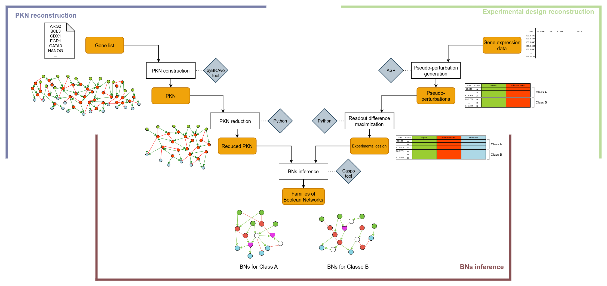

# scRNA2BoNI - scRNAseq data to Boolean Network Inference

scRNA2BoNI is a general framework to infer Boolean networks from scRNAseq data.




The framework searches to compute families of Boolean networks that are compatible with scRNAseq data and with prior regulatory knowledge. It is composed of three main steps:
1. The PKN reconstruction.
2. The experimental design construction.
3. The BNs inference.

### Prerequisites

scRNABoNI only works under Python 3.8. Two submodules, included in the scRNA2BoNI package, are required:
* [pyBRAvo](https://github.com/mathieubolteau/pyBRAvo) 
* [Caspo](https://github.com/mathieubolteau/caspo)

### Installation

1. Clone the repository including submodules.
    * `git clone --recursive git@github.com:mathieubolteau/scRNA2BoNI.git`
2. Install anaconda/miniconda to create virtual env.
    * Please follow instructions here: [https://docs.conda.io/en/latest/miniconda.html](https://docs.conda.io/en/latest/miniconda.html)
3. Create a virtual env, **under Python 3.8**.
    * `conda create -y --name scRNABoNI_env python==3.8`
4. Activate your virtual env.
    * `conda activate scRNABoNI_env`
5. Install scRNA2BoNI, submodules and requirements.
    
    ```sh
    cd scRNA2BoNI
    pip install ./scRNA2BoNI/pyBRAvo/.                 # Install pyBRAvo 
    pip install -r ./scRNA2BoNI/caspo/requirements.txt # Install Caspo requirements
    pip install ./scRNA2BoNI/caspo/.                   # Install Caspo
    pip install .                                      # Install scRNA2BoNI
    ```
6. Verify that scRNA2BoNI is installed
    * `scRNA2BoNI --help` 

## Usage

```
scRNA2BoNI --help
usage: scRNA2BoNI [-h] [--pkn-construction] [--preprocessing]
                  [--pseudo-perturbation-inference] [--bns-inference]
                  configuration_file

positional arguments:
  configuration_file    configuration file path

optional arguments:
  -h, --help            show this help message and exit
  --pkn-construction    run the PKN construction
  --preprocessing       run the preprocessing step
  --pseudo-perturbation-inference
                        run the pseudo-perturbations inference
  --bns-inference       run the BNs inference
```

scRNA2BoNI works with a configuration file to fix the parameters of each step of the framework. 

To make the *PKN reconstruction step* run the following command: 
```
scRNA2BoNI --pkn-construction --preprocessing <CONFIG FILE>
```

To make the *Experiemental design construction* run the following command. Notice that step required that the previous step has already been completed.
```
scRNA2BoNI --pseudo-perturbation-inference <CONFIG_FILE>
```

To make the *BNs inference* step, run the following command:
```
scRNA2BoNI --bns-inference <CONFIG_FILE>
```

## Demo

In the `demo` folder, a toy dataset to test the installation of scRNA2BoNI and see the expected results for this toy dataset.

To reproduce the expected results, using the configuration file present in the `demo/data` folder, run the following steps.

1. Modify paths in the `demo_config.ini` file. See *PATHS*, *DATA* and *PKN CONSTRUCTION* sections.

2. Run the following command:

```
scRNA2BoNI --pkn-construction --preprocessing --pseudo-perturbation-inference --bns-inference <YOUR_PATH>/scRNA2BoNI/demo/data/demo_config.ini
```

The execution should take 3/4 minutes.

## Author
* Mathieu Bolteau 
    * [@mathieubolteau](https://github.com/mathieubolteau)
    * [mathieu.bolteau@ls2n.fr](mailto:mathieu.bolteau@ls2n.fr)
    * Nantes Université, Ecole Centrale Nantes, CNRS, LS2N, UMR 6004, F-44000, Nantes